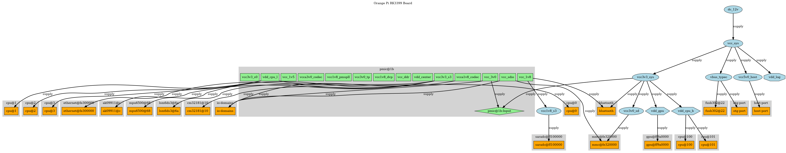
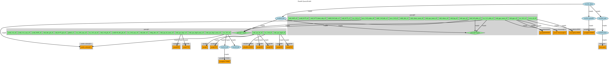

# DTB Regulator & Clock Visualizer
A utility to generate diagrams from Device Tree Blobs (DTBs).

## Features
* Regulator Hierarchy: Visualize power regulator connections.

## Planned Features
* Clock hierarchy diagrams.

## Usage
Basic usage, produces a dot file.
```
$ ./fdt2 <your_dt.dtb>
```

or directly the image.
```
$ ./fdt2 <your_dt.dtb> | dot -Tpng >your_dt_regulators_diagram.png

```

## Examples
**Orange Pi RK3399 Board**

**Pine64 QuartzPro64**

